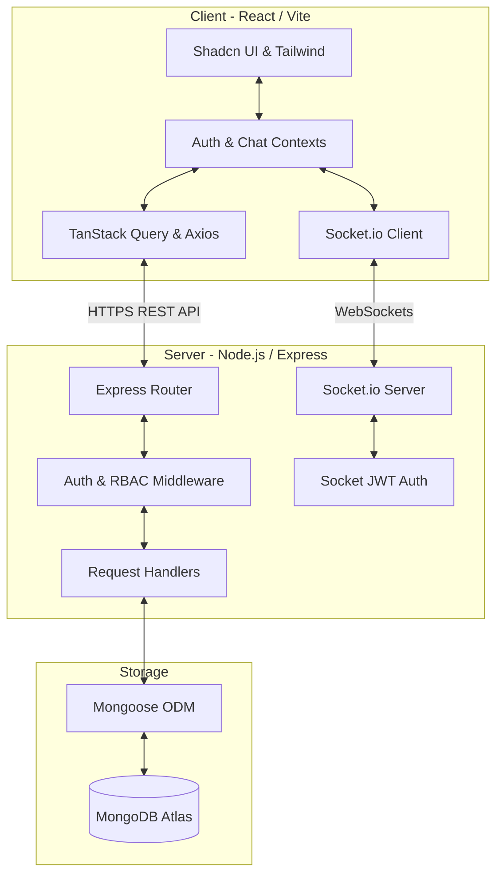

# 🦷 Navadia Dental Clinic Management System
## Project & Technical Documentation

A full-stack, enterprise-grade dental clinic management platform designed to streamline operations, facilitate patient-dentist relationships, manage HR workflows, and support real-time staff communication.

---

## 🏗️ Decoupled System Architecture

The application is built on a decoupled client-server architecture with secure real-time communication channels using WebSockets (Socket.io) and REST API endpoints (Express). 



### Key Architectural Characteristics
1. **Unified Auth & Communication States**: Token-based authentication using **JWT** that controls both HTTP API requests (sent in headers as `Authorization: Bearer <token>`) and Socket.io channel authorization (sent inside `handshake.auth.token`).
2. **Resilient Local Fallback (Offline Mode)**: Both `AuthContext` and `ChatContext` contain a hybrid state mechanism. If the backend server goes offline or becomes unreachable, the client automatically defaults to `localStorage` operations, caching new messages, signups, and check-ins, then syncing when connection is restored.
3. **Role-Based Routing**: Dynamic path rendering in React Router based on user authorization, grouping dashboards into specific portals (`/admin/dashboard`, `/dentist/dashboard`, `/staff/dashboard`).

---

## 🗄️ Database Schemas & Mongoose Models

The database layer runs on MongoDB via Mongoose ODM. Below is the detailed breakdown of the 9 primary schemas.

### 1. User Schema (`User.js`)
Stores all clinical and administrative staff details.
* **Fields**:
  * `name` (String, required): Full name of the user.
  * `email` (String, required, unique): Work email address.
  * `password` (String, required): Encrypted hashed password (hashed with Bcrypt, salt rounds: 10).
  * `role` (String, enum: `['Admin', 'Dentist', 'Staff']`, default: `'Staff'`, required): Access level controls.
  * `phone` (String): Primary contact number.
  * `alternatePhone` (String): Backup contact number.
  * `dateOfBirth` (String): Date of birth.
  * `gender` (String, enum: `['Male', 'Female', 'Other', '']`, default: `''`): Gender identity.
  * `bloodGroup` (String): Blood category.
  * `aadhaarNo` (String): Unique 12-digit Indian national identity number.
  * `panNo` (String): Permanent Account Number.
  * `address` (String): Residential address.
  * `city` (String): City.
  * `state` (String): State.
  * `country` (String, default: `'India'`): Country.
  * `pincode` (String): Pin/Zip code.
  * `emergencyContact` (String): Name of emergency contact.
  * `emergencyPhone` (String): Contact number of emergency contact.
  * `specialization` (String): Dental specialty (e.g. Orthodontics, Endodontics) - *Dentists only*.
  * `licenseNo` (String): Dental council registration number - *Dentists only*.
  * `joiningDate` (Date, default: `Date.now`): Official date of joining.
  * `branch` (ObjectId, ref: `'Branch'`): Associated clinic branch.
  * `isActive` (Boolean, default: `true`): Indicates active employment status.
  * `createdAt` (Date, default: `Date.now`): Timestamp of user creation.

### 2. Patient Schema (`Patient.js`)
Maintains demographic records and clinical status for patients.
* **Fields**:
  * `mrn` (String, required, unique): Medical Record Number formatted as `PT-2025-XXXX` (where `XXXX` is the padded count of existing patients).
  * `name` (String, required): Patient name.
  * `phone` (String, required): Primary phone number.
  * `email` (String): Contact email.
  * `dob` (String): Date of birth.
  * `gender` (String): Gender identity.
  * `bloodGroup` (String): Patient's blood group.
  * `lastVisit` (Date, default: `Date.now`): Last check-in or appointment date.
  * `status` (String, enum: `['Active', 'Inactive']`, default: `'Active'`): Direct medical status.
  * `balance` (String, default: `'$0'`): Current outstanding billing balance.
  * `createdAt` (Date, default: `Date.now`): Timestamp of creation.

### 3. Appointment Schema (`Appointment.js`)
Tracks scheduler records mapped to treatment chairs, patients, and dentists.
* **Fields**:
  * `time` (String, required): Start time of the appointment (e.g. `'10:00 AM'`).
  * `duration` (Number, default: `1`): Number of hours/slots reserved.
  * `patient` (String, required): Direct patient name.
  * `patientId` (ObjectId, ref: `'Patient'`): Reference to full patient profile.
  * `procedure` (String, required): Treatment or clinical process (e.g. `'Root Canal'`).
  * `dentist` (String, required): Dentist name.
  * `dentistId` (ObjectId, ref: `'User'`): Reference to Dentist user profile.
  * `status` (String, enum: `['scheduled', 'confirmed', 'inChair', 'completed', 'cancelled']`, default: `'scheduled'`): Current stage of appointment.
  * `chair` (Number, required): Assigned operating dental chair number.
  * `date` (String, required): Date formatted as `YYYY-MM-DD`.
  * `createdAt` (Date, default: `Date.now`): Timestamp of scheduling.

### 4. Attendance Schema (`Attendance.js`)
Tracks the check-in and check-out workflows for HR tracking.
* **Fields**:
  * `userId` (ObjectId, ref: `'User'`, required): Associated user record.
  * `userName` (String, required): Full name of the user.
  * `date` (String, required): Calendar date formatted as `YYYY-MM-DD`.
  * `checkIn` (String): Check-in timestamp (e.g. `'09:05 AM'`).
  * `checkOut` (String): Check-out timestamp (e.g. `'06:15 PM'`).
  * `breakTime` (Number, default: `0`): Duration of break sessions in minutes.
  * `status` (String, enum: `['Present', 'Absent', 'Late', 'On Leave']`, default: `'Present'`): Work status classification.
  * `createdAt` (Date, default: `Date.now`): Record creation timestamp.

### 5. LeaveRequest Schema (`LeaveRequest.js`)
Allows staff to request leaves and handles administrative reviews.
* **Fields**:
  * `userId` (ObjectId, ref: `'User'`, required): Requesting user.
  * `userName` (String, required): Name of requesting staff member.
  * `type` (String, required): Category of leave (e.g. `'Casual'`, `'Sick'`, `'Maternity'`).
  * `startDate` (String, required): Leave start date (`YYYY-MM-DD`).
  * `endDate` (String, required): Leave end date (`YYYY-MM-DD`).
  * `reason` (String): Written justification.
  * `status` (String, enum: `['Pending', 'Approved', 'Rejected']`, default: `'Pending'`): Administrative decision state.
  * `createdAt` (Date, default: `Date.now`): Time request was submitted.

### 6. Task Schema (`Task.js`)
Operational todo lists assigned to users or specific roles.
* **Fields**:
  * `title` (String, required): Task heading/summary.
  * `description` (String): Additional checklists or notes.
  * `assignedTo` (String, required): ID of the assigned staff or dentist.
  * `role` (String): Departmental role filter (e.g. `'Staff'`, `'Dentist'`).
  * `status` (String, default: `'pending'`): Current state of completion (`'pending'`, `'in-progress'`, `'completed'`, `'cancelled'`).
  * `priority` (String, default: `'medium'`): Priority flag (`'low'`, `'medium'`, `'high'`, `'urgent'`).
  * `dueDate` (String): Due date (`YYYY-MM-DD`).
  * `createdBy` (String): Creator's User ID.
  * `createdByName` (String): Creator's name.
  * `createdAt` (Date, default: `Date.now`): Timestamp of creation.

### 7. Message Schema (`Message.js`)
Enables direct and group messaging, as well as broadcast communication channels.
* **Fields**:
  * `sender` (ObjectId, ref: `'User'`, required): User who sent the message.
  * `senderName` (String, required): Name of sender.
  * `receiver` (String, required): Target receiver ID or `'broadcast'` for channel-wide chats.
  * `content` (String, default: `''`): Text message body.
  * `voiceNote` (String): Base64 encoded audio string or audio file URL.
  * `isEdited` (Boolean, default: `false`): Tracks if a message has been updated.
  * `isRead` (Boolean, default: `false`): Receipt read indicator.
  * `timestamp` (Date, default: `Date.now`): Message timestamp.

### 8. Voicemail Schema (`Voicemail.js`)
Enables recorded audio message repositories for receptionist workflows.
* **Fields**:
  * `audioFile` (String, required): Base64 audio stream or audio path URL.
  * `assignedTo` (String, required): ID or Name of targeted recipient (staff/dentist).
  * `message` (String): Auto-transcription text or additional notes.
  * `createdBy` (String): Submitter's username or admin identifier.
  * `createdAt` (Date, default: `Date.now`): Voicemail timestamp.

### 9. ClinicSetting Schema (`ClinicSetting.js`)
Clinic configuration values managed by the administrator.
* **Fields**:
  * `clinicName` (String, required, default: `'Navadia Dental Clinic'`): Organization name.
  * `email` (String, default: `'contact@navadia.com'`): Administrative email address.
  * `phone` (String, default: `'+91 98765 43210'`): General inquiry hotline.
  * `address` (String, default: `'101, Medical Plaza, Surat, Gujarat'`): Clinic address.
  * `workingHours` (String, default: `'09:00 AM - 08:00 PM'`): Standard working hours.
  * `updatedAt` (Date, default: `Date.now`): Timestamp of the last change.

---

## 🚦 API Routes & Controller Logic

The backend routing system is fully protected by JWT authorization and Role-Based Access Control (RBAC) middleware.

### Middleware Layer
* **`verifyJWT`**: Decodes the authorization token from headers, fetches the corresponding user from the database, and injects the user into `req.user`.
* **`checkRole(...roles)`**: Validates if the user's role is within the list of authorized roles. If unauthorized, returns `403 Forbidden`.

### Endpoint Mapping

#### 1. Authentication (`/api/auth`)
* `POST /signup`: Used for admin signups. Validates name against authorized administrator names (`['Dr. Jatin', 'Dr. Dimpal', 'Super Admin']`). Other names return `403 Forbidden`.
* `POST /login`: Receives email & password, validates hash, and returns a 30d JWT.
* `PUT /profile` *[Protected]*: Updates the current user's profile details.

#### 2. Staff Management (`/api/staff`)
* `GET /`: Retrieves details of all registered users (excluding passwords) sorted alphabetically.
* `GET /:id`: Fetch detailed record of a single staff member.
* `POST /` *[Admin Only]*: Creates a new staff or dentist. Performs duplicate email, phone, and 12-digit Aadhaar number validations.
* `PUT /:id` *[Admin Only]*: Modifies professional and personal details of a staff member.
* `DELETE /:id` *[Admin Only]*: Deletes a staff member from the database.

#### 3. Patients (`/api/patients`)
* `GET /`: Retrieves list of all patients sorted by newest first.
* `POST /` *[Admin, Staff Only]*: Automatically generates a Medical Record Number (`PT-2025-XXXX`) by counting total documents and incrementing by 1, then creates the patient profile.
* `PUT /:id` *[Admin, Staff Only]*: Updates patient demographics.
* `DELETE /:id` *[Admin Only]*: Deletes a patient profile.

#### 4. Appointments (`/api/appointments`)
* `GET /`: Lists all appointments (can be filtered by query parameter `?date=YYYY-MM-DD`).
* `POST /`: Books a new slot.
* `PATCH /:id/status`: Updates appointment status (`'scheduled'`, `'confirmed'`, `'inChair'`, `'completed'`, `'cancelled'`).
* `DELETE /:id`: Removes a scheduled appointment.

#### 5. Attendance (`/api/attendance`)
* `GET /`: Fetches check-in logs. Filters by `userId` or `date` via query parameters.
* `POST /check-in`: Registers daily check-in. If a record already exists for the day, updates it to support shift restarts.
* `POST /check-out`: Registers check-out. Updates break times and status.

#### 6. Leave Requests (`/api/leave`)
* `GET /`: Lists all leave applications.
* `POST /`: Staff submits a new leave request. Emits a WebSocket broadcast (`leave_applied`) to notify admins.
* `PATCH /:id/status` *[Admin Only]*: Approves or rejects a request. Emits a target WebSocket event (`leave_updated`) to notify the requesting user.

#### 7. Tasks (`/api/tasks`)
* `GET /`: Retrieves tasks. Non-admins only see tasks assigned to them or created by them. Admins see all tasks.
* `POST /`: Creates a new task. Emits a WebSocket notification (`task_assigned`).
* `PUT /:id`: Modifies task parameters (status, priority, dueDate).
* `DELETE /:id` *[Admin Only]*: Removes a task.

#### 8. Messages (`/api/messages`)
* `GET /`: Fetches all messages involving the current user (sent, received, or broadcasted).
* `POST /`: Sends a direct message or broadcast. Emits WebSocket event `receive_message`. Supports optional voice note (base64 string).
* `PUT /:id`: Edits a message sent by the user. Emits event `message_edited`.
* `DELETE /:id`: Deletes a message sent by the user. Emits event `message_deleted`.
* `PUT /:id/read`: Marks a message as read. Emits event `message_read`.

#### 9. Voicemails (`/api/voicemails`)
* `GET /`: Retrieves voicemails.
* `POST /` *[Admin Only]*: Logs a new voicemail audio file.
* `DELETE /:id`: Removes a voicemail.

#### 10. Settings (`/api/settings`)
* `GET /`: Fetches clinic global settings (initializes with defaults if none exists).
* `PUT /` *[Admin Only]*: Saves new clinic-wide contact and operating parameters.

---

## ⚡ WebSocket Communication Protocol (Socket.io)

Socket.io enables real-time synchronization between clients and the backend.

### Authentication & Identification
When connecting, the client passes their token in the headers. The server validates the token, extracts the user ID, maps the user to their socket ID, and adds the mapping to `onlineUsers` (a Map tracking `userId -> [socketIds]`).

### Event Lifecycle

| Event Name | Sent By | Description | Payload Data |
| :--- | :--- | :--- | :--- |
| `connection` | Client | Initiates WebSocket connection. | JWT Auth handshake |
| `joined` | Server | Confirms handshake validation. | `{ userId: String }` |
| `receive_message` | Server | Forwards new message to recipient and sender client tabs. | `ChatMessage` object |
| `leave_applied` | Server | Alerts online Admins of new leave applications. | `LeaveRequest` object |
| `leave_updated` | Server | Alerts staff member of status update. | `LeaveRequest` object |
| `task_assigned` | Server | Alerts user they have been assigned a task. | `Task` object |
| `message_edited` | Server | Syncs updated message text. | `ChatMessage` object |
| `message_deleted` | Server | Syncs message deletion across clients. | `{ id: String }` |
| `message_read` | Server | Syncs read receipt checkmark to sender. | `{ id: String }` |

---

## 💻 Frontend Pages & State Management

The frontend is a single-page application (SPA) built with React 18, TypeScript, and Vite.

### Core Portals (Role-Based Dashboards)

#### 1. Admin & Superadmin Dashboard
* **Route**: `/admin/dashboard` & `/superadmin/dashboard`
* **Features**:
  * Statistics cards showing revenue trends, patient visits, task completion ratios, and check-in counts.
  * Interactive Recharts financial chart showing clinic revenue logs.
  * Real-time activity log showing check-ins, leaves, and database entries.
  * Quick access panels to approve leave requests, review staff lists, and update settings.

#### 2. Dentist Dashboard
* **Route**: `/dentist/dashboard`
* **Features**:
  * Actionable daily schedule showing patient appointments, status, and chair allocations.
  * Quick patient check-in buttons (e.g. *In Chair*, *Complete*).
  * Direct access to patient medical histories and diagnostic files.
  * Individualized task planner showing treatment-related lists.

#### 3. Reception / Staff Dashboard
* **Route**: `/reception/dashboard` & `/staff/dashboard`
* **Features**:
  * Central booking panel showing chair statuses (vacant vs occupied).
  * Simplified patient creation panel.
  * Voicemail inbox for logging voice calls and assigning transcription tasks.
  * Check-in/check-out cards with real-time break counters.

---

### Core Operational Screens

#### 1. Appointments Screen (`/appointments`)
* High-fidelity calendar view filtered by date and chair.
* Dialog booking forms with patient search, dentist selection, time slot allocation, and procedure details.
* Quick-action status dropdowns (`'scheduled'`, `'confirmed'`, `'inChair'`, `'completed'`, `'cancelled'`).

#### 2. Attendance Screen (`/attendance`)
* **Timecard Widget**: Check-in button, check-out button, break toggles, and a live duration timer.
* **Attendance History**: Data table showing check-in/out timestamps, total break time, work duration, and statuses.
* Admins can view logs for all staff members; staff members can only view their own logs.

#### 3. Patients Screen (`/patients`)
* Dynamic database table showing medical records with patient MRN, last visit dates, status, and balances.
* Action forms to register new patients.
* Detailed patient drawer showing history, contact information, and billing balances.

#### 4. Tasks Screen (`/tasks`)
* **Kanban Board**: Drag-and-drop styled interfaces columns (`'pending'`, `'in-progress'`, `'completed'`, `'cancelled'`).
* Filters for priority status (`'low'`, `'medium'`, `'high'`, `'urgent'`) and search criteria.
* Create forms with role-based assignment filters.

#### 5. Leave Requests Screen (`/leave-requests`)
* Submit requests (dates, type, reason).
* Review tables: Staff see status histories; Admins see action buttons to approve or reject requests.

#### 6. Messages / Collaboration Screen (`/messages`)
* Full chat directory listing active staff members and their online statuses.
* Chat window supporting direct messages and a clinic-wide broadcast channel.
* Voice messaging widget supporting audio recording, playback, and uploading as base64.
* Message hover menus supporting editing, deleting, and marking as read.

---

## 📂 Repository Directory Layout

```text
navadia/
├── backend/                   # Node/Express API server
│   ├── config/                # Database connections (db.js)
│   ├── middleware/            # JWT and RBAC validators (authMiddleware.js)
│   ├── models/                # Mongoose Database schemas
│   ├── routes/                # Express API endpoints
│   ├── index.js               # Entry point, Socket.io setups
│   └── package.json           # Server dependency configuration
├── src/                       # React frontend source
│   ├── components/            # Reusable components & dashboard shell layouts
│   ├── config/                # API settings (api.ts)
│   ├── contexts/              # React Contexts (AuthContext, ChatContext)
│   ├── hooks/                 # Custom UI hooks (use-toast)
│   ├── lib/                   # Utility scripts (cn)
│   ├── pages/                 # Full dashboard views and portal screens
│   ├── App.tsx                # Main router definitions
│   └── main.tsx               # Client entry point
├── package.json               # Root workspace configuration
└── tsconfig.json              # TypeScript compilation rules
```

---

## 🚀 Setup & Execution Guide

### 1. Backend Server Setup
1. Navigate to the `backend/` folder:
   ```bash
   cd backend
   ```
2. Install dependencies:
   ```bash
   npm install
   ```
3. Set up environment variables in a `.env` file:
   ```env
   PORT=5000
   MONGO_URI=mongodb+srv://<username>:<password>@cluster.mongodb.net/navadia_db
   JWT_SECRET=your_jwt_signing_key_here
   NODE_ENV=development
   ```
4. Start the server:
   ```bash
   npm run server   # starts nodemon dev server
   # or
   npm start        # starts standard node server
   ```

### 2. Frontend Client Setup
1. Return to the root folder:
   ```bash
   cd ..
   ```
2. Install client dependencies:
   ```bash
   npm install
   ```
3. Configure backend URL (Optional, defaults to `http://localhost:5000`):
   ```env
   VITE_API_URL=http://localhost:5000
   ```
4. Start the local Vite server:
   ```bash
   npm run dev
   ```
