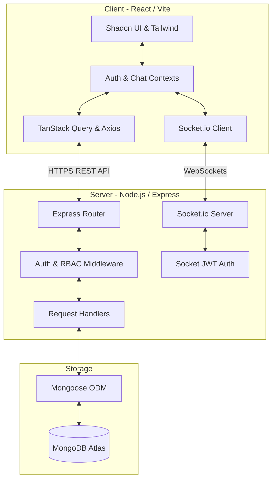

# Navadia Dental Clinic Management System

A modern, full-stack, enterprise-grade dental clinic management platform designed to streamline operations, facilitate patient-dentist relationships, manage HR workflows, and support real-time staff communication.

[](#technology-stack)
[](#real-time-features)
[](#license)

---

## 🏗️ System Architecture

The application is built on a decoupled client-server architecture with secure real-time communication channels.



---

## ⚡ Core Features

### 👥 Role-Based Dashboards
* **Admin / Superadmin**: Comprehensive statistics, financial charts, staff management logs, leave request approval workflows, and clinic-wide settings.
* **Dentist**: Treatment scheduler, patient dental records, specific task assignments, and internal chat.
* **Receptionist / Staff**: Appointment booking engine, patient check-ins, voicemail logs, check-in/out attendance controls, and task checklists.

### 💬 Real-Time Collaboration
* Real-time employee chat platform using **Socket.io** with instant read receipt status, group scopes, and direct messages.
* Immediate notifications for leave approvals, task assignments, and check-in statuses.

### 📅 Patient & Appointment Management
* Dynamic appointment calendar filtered by date, dentist, or status.
* Patient profiles containing demographic details, contact info, clinical records, and treatment plans.
* Voicemail records repository with status tracking (New, In Progress, Resolved).

### 💼 HR & Operations Suite
* **Attendance System**: Instant check-in/out logging with dynamic duration counters and history tables.
* **Leave Requests**: Request submission forms for staff, and an administrative review panel.
* **Task Board**: Task assignment, status updates, priority tagging, and progress bars.

---

## 🛠️ Technology Stack

| Component | Technology | Description |
| :--- | :--- | :--- |
| **Frontend** | React 18, TypeScript | Single-page application logic |
| **Build Tool** | Vite | Ultra-fast client builds & dev server |
| **Styling** | Tailwind CSS, Lucide Icons | Responsive utility-first design system |
| **UI Components** | Shadcn UI, Radix Primitives | Accessible and interactive components |
| **State & Data** | TanStack Query, Axios | Server state management & API client |
| **Backend API** | Node.js, Express.js | REST APIs and server orchestration |
| **Real-time** | Socket.io | Bidirectional event-driven communication |
| **Database** | MongoDB, Mongoose | Document-oriented storage & schema models |
| **Security** | JWT, Bcrypt | Token authentication and password hashing |

---

## 📁 Repository Structure

```text
navadia-final/
├── backend/                 # Express API server
│   ├── config/              # MongoDB connection setup
│   ├── middleware/          # JWT and role authorization middleware
│   ├── models/              # Mongoose data schemas (User, Patient, etc.)
│   ├── routes/              # Express API endpoints
│   ├── index.js             # Server entry point and Socket.io setup
│   └── vercel.json          # Deployment configuration
├── src/                     # React frontend source
│   ├── components/          # Reusable UI components & Sidebar
│   ├── config/              # API endpoints helper
│   ├── contexts/            # React Auth and Chat contexts
│   ├── hooks/               # Custom state hooks
│   ├── pages/               # Routed page views (Login, Dashboards, Tasks...)
│   ├── App.tsx              # Main Router and route definitions
│   └── main.tsx             # Frontend entry point
├── package.json             # Root workspace configuration
└── tailwind.config.ts       # Design system utility definitions
```

---

## 🚀 Installation & Local Development

### Prerequisites
* **Node.js** (v18.x or later recommended)
* **MongoDB** (Local instance or MongoDB Atlas cluster connection)
* **npm** or **Bun** package manager

### 1. Backend Configuration

1. Navigate to the backend directory:
   ```bash
   cd backend
   ```
2. Install dependencies:
   ```bash
   npm install
   ```
3. Create a `.env` file in the `backend/` folder matching the variables below:
   ```env
   PORT=5000
   MONGO_URI=your_mongodb_connection_uri
   JWT_SECRET=your_jwt_secret_key
   NODE_ENV=development
   ```
4. Start the server:
   ```bash
   node index.js
   ```
   *The backend server will run at `http://localhost:5000` by default.*

### 2. Frontend Configuration

1. Return to the root folder:
   ```bash
   cd ..
   ```
2. Install dependencies:
   ```bash
   npm install
   # or using Bun
   bun install
   ```
3. Optionally set up the API environment variable (defaults to `http://localhost:5000` if not specified):
   ```env
   VITE_API_URL=http://localhost:5000
   ```
4. Start the local Vite development server:
   ```bash
   npm run dev
   ```
   *The frontend dashboard will be available at the local address printed by Vite (typically `http://localhost:8080` or `http://localhost:5173`).*

---

## 🔒 Role-Based Permissions Matrix

| Module | Admin | Dentist | Receptionist / Staff |
| :--- | :---: | :---: | :---: |
| **System Settings** | ✅ Full Access | ❌ None | ❌ None |
| **Staff & HR** | ✅ Full Access | ❌ None | ❌ None |
| **Leave Approvals** | ✅ Approval | ❌ Read Only | ❌ Read Only |
| **Patient Database** | ✅ Full Access | ✅ Write / Read | ✅ Write / Read |
| **Appointments** | ✅ Full Access | ✅ View / Update | ✅ Booking Engine |
| **Voicemail Logs** | ✅ Full Access | ❌ None | ✅ Write / Read |
| **Clinical Records** | ✅ Full Access | ✅ Clinical Work | ❌ None |
| **Chat & Tasks** | ✅ Full Access | ✅ Full Access | ✅ Full Access |

---

## 🛡️ License

This project is licensed under TRG GRANTH.
